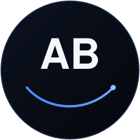

<div align="center">



<br/>


</div>

<br/>

## À propos de moi

Je m'appelle **Abel Belei**, je suis togolais et j'étudie le **Génie Logiciel** en licence professionnelle. Je n'avais pas de plan de carrière tout tracé en commençant — j'avais surtout envie de comprendre comment les choses marchent, et cette envie ne m'a pas quitté depuis.

Ce qui m'intéresse le plus, c'est de suivre un système du début à la fin : du bouton sur lequel quelqu'un clique jusqu'au serveur qui tourne derrière. En ce moment, **Java** et **Spring Boot** sont mes outils du quotidien, **React** vient compléter côté client, et j'apprends **Docker**, **Kubernetes** et **AWS** petit à petit pour comprendre ce qui se passe après le déploiement.

J'aimerais, à terme, contribuer à des projets open source et construire des outils qui servent vraiment à quelqu'un — en particulier pour des étudiants africains. C'est l'idée derrière quelques projets personnels que je fais avancer en dehors de mes cours, comme une plateforme d'orientation scolaire ou un outil de gestion pour une équipe de basketball.

En dehors du code, je joue au basketball, et les deux se ressemblent plus qu'on ne le pense : il faut s'entraîner régulièrement, accepter de rater avant de réussir, et revenir aux fondamentaux quand quelque chose ne marche pas.

<br/>

## Stack Technique

<div align="center">

**Backend**


**Frontend**


**Bases de données**


**Outils**


**En apprentissage**


</div>

<br/>

## Projets phares

<!-- Ces 4 dépôts sont réels (vérifiés sur github.com/BELADEL228). Ajuste les descriptions si l'un d'eux fait autre chose que ce qui est décrit ici. -->

<table>
<tr>
<td width="50%" valign="top">

### Portfolio_RA
Mon portfolio personnel, écrit en TypeScript — une vitrine simple de mes projets et de mon profil de développeur.

`TypeScript`

**[→ Voir le projet](https://github.com/BELADEL228/Portfolio_RA)**

</td>
<td width="50%" valign="top">

### MyPORTFOLIO
Une première version de mon portfolio, en CSS pur.

`CSS`

**[→ Voir le projet](https://github.com/BELADEL228/MyPORTFOLIO)**

</td>
</tr>
<tr>
<td width="50%" valign="top">

### Ulchallengepage
Une page réalisée dans le cadre d'un challenge front-end, pour m'entraîner sur le HTML et le CSS.

`HTML` `CSS`

**[→ Voir le projet](https://github.com/BELADEL228/Ulchallengepage)**

</td>
<td width="50%" valign="top">

### 2025.countdown
Une petite application de compte à rebours pour la nouvelle année — simple, mais menée de bout en bout.

`HTML`

**[→ Voir le projet](https://github.com/BELADEL228/2025.countdown)**

</td>
</tr>
</table>

<div align="center">

<a href="https://github.com/BELADEL228?tab=repositories"></a>

</div>

<br/>

## Ce sur quoi je travaille en ce moment

```text
2026 → renforcer Java & Spring Boot, construire en Full-Stack, apprendre Docker → Kubernetes → AWS
```

Mon objectif pour cette année est simple : consolider mes bases en Java et Spring Boot, construire davantage en Full-Stack avec React, et avancer pas à pas vers le DevOps.

Je suis aussi à la recherche de projets open source où contribuer et apprendre au contact d'autres développeurs. Si tu veux discuter de Java, Spring Boot, React, DevOps, cloud — ou basketball — n'hésite pas à me contacter.

<br/>

## Statistiques GitHub

<div align="center">


</div>

<br/>

## Graphique d'activité

<div align="center">


</div>

<br/>

## Calendrier de contributions

<div align="center">


</div>

<br/>

## Trophées GitHub

<div align="center">


</div>

<!-- Ce widget est servi par une instance publique gratuite (github-profile-trophy.vercel.app), parfois surchargée.
     S'il ne s'affiche pas après un rafraîchissement de la page, réessaie dans quelques minutes,
     ou remplace l'URL par un miroir de la communauté — la liste est dans docs/SETUP.md. -->

<br/>

## Contributions, jour après jour

<div align="center">

<!-- Généré automatiquement par .github/workflows/snake.yml sur la branche "output" -->


</div>

<br/>

## Activité récente

<!--START_SECTION:activity-->
<!-- Cette section est mise à jour automatiquement par .github/workflows/update.yml -->
<!--END_SECTION:activity-->

<br/>

## Me contacter

<!-- Remplace les liens ci-dessous par tes véritables profils / adresse. -->

<div align="center">

<a href="mailto:abel.belei@example.com"></a>
<a href="https://linkedin.com/in/abel-belei"></a>
<a href="https://twitter.com/BELADEL228"></a>
<a href="https://github.com/BELADEL228"></a>

</div>

<br/>

## Soutenir

Si un de mes projets te sert ou t'inspire, laisser une étoile sur le dépôt fait toujours plaisir.

<div align="center">

<a href="https://github.com/sponsors/BELADEL228"></a>
<a href="https://buymeacoffee.com/beladel228"></a>

</div>

<br/>

<div align="center">

> *« Le code, comme le basketball, ça s'apprend en le pratiquant — pas en le regardant. »*
> — Abel Belei

<br/>



**Abel Belei** · Togo · Génie Logiciel

</div>
